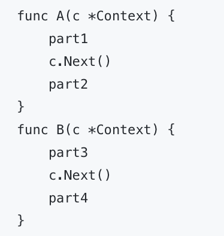

练习代码部分

## day1

- 搭建了框架的雏形

- 简单学习了`net/http`库的使用

## day2

- 抽取`router`,方便后续进行增强

- 设计上下文`Context`,封装`请求体`和`响应体`，提供对JSON、HTML、String、Data等返回类型的支持

## day3

- 将day2抽取的`router`实现增强 

- 使用**Trie前缀树**进行路由的匹配

## day4

- 实现同一实例下不同路由的**分组控制**

- 便于后续**中间件**对于对应的分组路由的**功能加强**

## day5

- 添加中间件支持

- 实现接收请求后 在控制台**打印请求处理时间**的功能 全局中间件功能

- 在Context中间添加`.Next()`函数，实现在**请求处理前/后执行中间件功**,如:

则执行顺序为 part1 -> part3 -> header -> part4 -> part2
